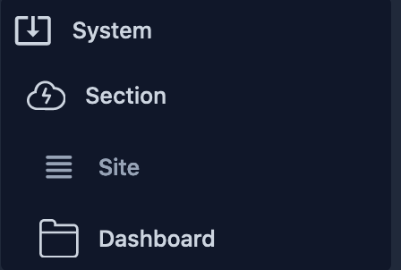

# MenuBundle

[](https://scrutinizer-ci.com/g/Braunstetter/menu-bundle/?branch=main)
[](https://app.travis-ci.com/Braunstetter/MenuBundle)
[](https://packagist.org/packages/braunstetter/menu-bundle)
[](https://packagist.org/packages/braunstetter/menu-bundle)

## Pros of using this bundle

I used [KnpMenuBundle](https://github.com/KnpLabs/KnpMenuBundle) for all my symfony projects over years. It's a
wonderful piece of software and I'm very grateful for it, but I sometimes felt like I was fighting more the system
behind this bundle then writing menus.

As soon as I wanted to write my own matcher or change the rendering very specifically, it became uncomfortable.

So the pros of this bundle are very clear:

- no Matcher hell - when a template needs to activate a menu item it can be done by setting
  the [`selectedSubnavItem`](#activate-a-menu-item-when-its-not-a-direct-children)
- no rendering system to fight against. If you want to use the render blocks provided by this bundle - u are welcome -
  if not just fetch the raw data (with the active trail) and rock'n roll.

In addition to all of these avoidances, there are of course 'real' benefits as well.

- reuse your menu classes in different shapes (menu, breadcrumb) everywhere
- grow your ecosystem by letting others extend your finished menus using
  the [MenuEvent](#allow-others-to-extend-your-menus-with-menuevents) class.

## Installation

`composer require braunstetter/menu-bundle`

## Usage

Once installed you can create a menu by creating a class extending `Braunstetter\MenuBundle\Menu`.

```php
<?php


namespace App\Menu;

use Braunstetter\MenuBundle\Events\MenuEvent;
use Braunstetter\MenuBundle\Factory\MenuItem;
use Braunstetter\MenuBundle\Menu;
use Traversable;

class MainMenu extends Menu
{

    public function define(): Traversable
    {

        yield MenuItem::system('System', 'route_to_my_system', [], 'images/svg/system.svg')->setChildren(function () {
            yield MenuItem::section('Section', 'route_to_my_section', [], 'images/svg/thunder.svg')->setChildren(function () {
                yield MenuItem::linkToRoute('Site', 'site', [], 'images/svg/align_justify.svg');
                yield MenuItem::linkToRoute('Dashboard', 'cp_dashboard');
            });
        });

    }

}
```

The base path for images is just the `templates` folder of your application. But since this value will just be passed
into the [Twig source function](https://twig.symfony.com/doc/2.x/functions/source.html) you can also use an alias
like `@my_bundle/images/svg/thunder.svg`.

Inside your twig templates you can print the menu by using the `menu()` function and passing it the snake_cased class
name.

```html
{{ menu('main_menu') }}
```

The formatted result:



> Note: no css is shipped with this bundle. But as you can see, a ready-to-be-styled html markup gets printed once you use the menu() function.

### Types of MenuItems

```
MenuItem::system
MenuItem::section
MenuItem::linkToRoute
```

These items are basically the same but you can react to the different types inside your render loops, to give them a
unique styling. But it is also possible to just nest `MenuItem::linkToRoute`

## Breadcrumbs

The same menu defined inside the previous chapter can be used as a breadcrumb menu by just using the `breadcrumbs()`
twig function.

```html
 {{ breadcrumbs('main_menu') }}
```

A ready-to-be-styled markup gets rendered - divide by a caret.svg.

The main difference between the `breadcrumbs()` and the `menu()` function is, that `breadcrumbs()` just output a menu
tree line, as soon as it contains some active route. Then the iteration stops and this active tree leaf gets printed.

## Render menus by your own.

Sometimes you want to have complete control over the rendering of the menu with all the information needed in place.
That's why you can use the `menu_result()` and the `breadcrumbs_result()` twig functions just the same way as described
above. The only difference is, now you have the raw data instead of markup.

```html



{# do whatever you want with the data #}

```

If you decide to go this way you may find it helpful to use the blocks defined in:

[`menu_blocks.html.twig`](src/Resources/views/menu_blocks.html.twig)
and [`breadcrumb_menu_blocks.html.twig`](src/Resources/views/breadcrumb_menu_blocks.html.twig)

## Allow others to extend your menus with MenuEvents

If you build an ecosystem probably you would also like to give other users and / or bundles the option to extend or
change your menus.

This is very easy and straightforward with menu events. After you injected
the `Symfony\Contracts\EventDispatcher\EventDispatcherInterface` into the constructor of the menu class you are able to
dispatch events:

```php

$siteLinksEvent = new MenuEvent(
    yield MenuItem::linkToRoute('Site', 'site', [], 'images/svg/align_justify.svg');
    yield MenuItem::linkToRoute('Dashboard', 'cp_dashboard');
);

$this->eventDispatcher->dispatch($siteLinksEvent, 'app.main_menu');

yield from $siteLinksEvent->items;
```

Once you saved your menu inside a variable (`$siteLinks` in this case) you can create a `new MenuEvent($siteLinks)`. Now
you can dispatch events (e.g. 'app.main_menu')

The `Braunstetter\MenuBundle\Events\MenuEvent` holds the menu items **and** can prepend / append menu items. You can
create an EventSubscriber:

```php
<?php

namespace App\EventSubscriber;

use Braunstetter\MenuBundle\Events\MenuEvent;
use Braunstetter\MenuBundle\Factory\MenuItem;
use Symfony\Component\EventDispatcher\EventSubscriberInterface;
use Generator;

class MenuSubscriber implements EventSubscriberInterface
{

    /**
     * @param MenuEvent $event
     */
    public function onAppMainMenu(MenuEvent $event)
    {

        $event->prepend(function () {
            yield MenuItem::linkToRoute('Prepended', 'other');
        });

        $event->append(function () {
            yield MenuItem::linkToRoute('Appended', 'other');
        });

    }

    public static function getSubscribedEvents(): array
    {
        return [
            'app.main_menu' => 'onAppMainMenu',
        ];
    }
}
```

This way it's very easy to build an extensible menu system for your software ecosystem.

## Activate a menu item when it's not a direct children

Sometimes it's not just like every route is in a direct leaf of the parent, and we can just rely on these active trail.
Then you need to tell your menu system 'somehow' to activate a seemingly unrelated menu item (and to activate its active
trail).

Instead of going crazy with a custom Matcher you can just do that:

```


Hello!




  {# your content here #}

```

The Menu item matching this route will be active and all parents will be inside the active trail.

> Note: `selectedSubnavItem` has to be inside the global twig scope - therefore define it in between your blocks or pass it as a variable from inside your controller.

> The value of the `selectedSubnavItem` has to be equal to the handle of the MenuItem (snake cased label). 
